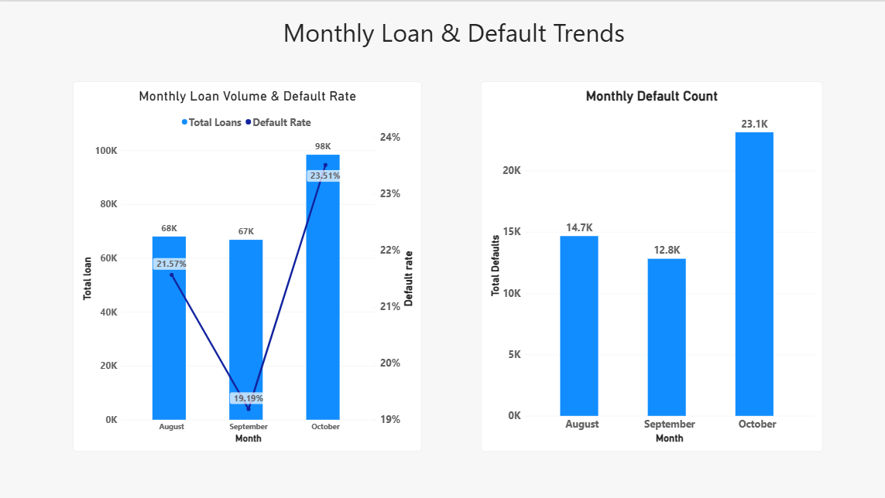

# Indian Vehicle Loan Credit Risk Analytics

## Project Overview

This project analyzes vehicle loan portfolio performance and credit risk using **Python, MySQL, and Power BI**. The analysis focuses on identifying factors associated with first-EMI loan defaults and highlighting customer, loan, geographic, and operational risk areas.

### Project Workflow

Data Preparation → Python Analysis → SQL Analysis → Risk Segmentation → Power BI Dashboard → Business Insights

---

## Business Objectives

- Analyze overall loan portfolio and default performance
- Identify high-risk customer and loan segments
- Study the impact of LTV, credit history, overdue accounts, and delinquency
- Identify risky branches, suppliers, manufacturers, and locations
- Analyze monthly loan and default trends
- Develop actionable recommendations for credit risk monitoring

---

## Dataset

- **233,154 loan records**
- **41 original features**
- Target variable: `loan_default`
- Source: Public LTFS/Kaggle vehicle loan dataset

The analysis covers loan characteristics, customer credit behaviour, employment, geography, and operational information.

---

## Tools & Technologies

| Tool | Purpose |
|------|---------|
| Python | Data cleaning, EDA & feature engineering |
| Pandas & NumPy | Data analysis & transformation |
| MySQL | SQL-based analysis |
| Power BI | Interactive dashboard |
| DAX | Measures & KPIs |
| Git & GitHub | Version control |

---

# Python Analysis

Performed:

- Data exploration and quality checks
- Data cleaning and preparation
- Feature engineering
- LTV and credit risk segmentation
- Customer and credit behaviour analysis
- Geographic and operational analysis
- Supplier, branch, and monthly performance analysis

---

# SQL Analysis

SQL analysis covered:

- Portfolio performance
- Loan and LTV analysis
- Customer credit behaviour
- Risk segmentation
- Geographic analysis
- Branch and supplier performance
- Monthly default trends
- Advanced risk profiling

---

# Power BI Dashboard

### Page 1 — Portfolio Overview

**KPIs:** Total Loans, Total Defaults, Default Rate, Loan Amount, Asset Cost and LTV

**Visualizations:** Portfolio risk, loan distribution and monthly loan/default performance.

**Purpose:** Executive-level portfolio overview.

### Page 2 — Customer & Credit Risk

**Visualizations:** Credit score, previous overdue, delinquency, inquiries, credit history and risk categories.

**Purpose:** Identify customer-level credit risk signals.

### Page 3 — Geographic & Operational Risk

**Visualizations:** State, manufacturer, branch, supplier and branch-level risk.

**Purpose:** Identify geographic and operational risk concentrations.

### Page 4 — Monthly Loan & Default Trends

**Visualizations:** Monthly loan volume, default rate and total defaults.

**Purpose:** Monitor changes in portfolio performance over time.

---

# Key Findings

- Overall default rate: **21.71%**
- Very High Risk segment default rate: **33.16%**
- LTV 80–90% segment default rate: **25.88%**
- Customers with previous overdue accounts: **27.41%**
- Customers with recent delinquency: **27.09%**
- Supplier 1539 showed a **55.90%** default rate and requires further investigation
- October 2018 recorded the highest monthly default rate at **23.51%**

---

# Business Recommendations

1. Apply stronger controls to high-LTV loans.
2. Use previous overdue and recent delinquency as important risk indicators.
3. Closely monitor Very High Risk customer segments.
4. Review branches and suppliers with unusually high default rates.
5. Track monthly default trends for early identification of portfolio deterioration.

---

# Project Outcome

The project combines **SQL analysis, Python data analytics, and Power BI visualization** to convert a large vehicle-loan dataset into actionable credit-risk insights.

It demonstrates practical skills in **data cleaning, EDA, SQL, feature engineering, risk analysis, dashboard development, and business decision-making**.

---

## Project Skills Demonstrated

**SQL/MySQL | Python | Pandas | NumPy | EDA | Feature Engineering | Credit Risk Analysis | Power BI | DAX | Data Visualization | Business Intelligence**

---
# Dashboard Screenshots

### Portfolio Overview

### Customer & Credit Risk

### Geographic & Operational Risk

### Monthly Loan & Default Trends

